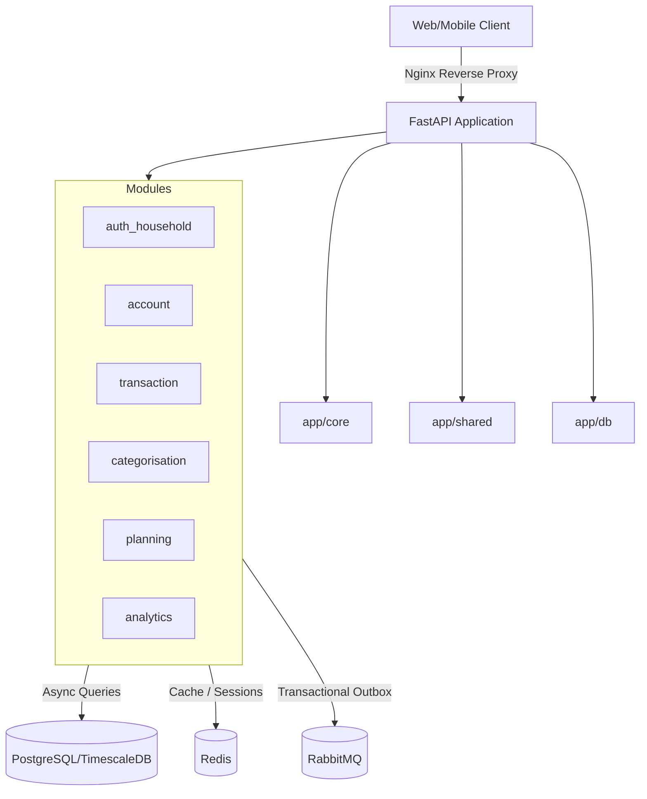

# Codebase Research: FamilyFinance Backend (finapp-backend)

This document provides a comprehensive analysis of the FamilyFinance backend (`finapp-backend`) repository. It documents the architecture, key modules, database design, API design, security implementations, testing strategy, and development constraints.

---

## 1. Architectural Overview

The FamilyFinance backend is designed as a **Modular Monolith** (Phase 1 implementation). It is built using **Python 3.12** and **FastAPI (>=0.115)**, with asynchronous database interactions powered by **SQLAlchemy 2.0 (async)** and migrations managed via **Alembic**.



### Core Architecture Principles
1. **Module Independence**: Each module is self-contained. Communication across module boundaries must only happen via clean service APIs, never by directly importing another module's models or repositories.
2. **Layered Module Internals**: Inside each module, code is structured cleanly into layers:
   `api/routes/` $\rightarrow$ `services/` $\rightarrow$ `repositories/` $\rightarrow$ `models/` $\rightarrow$ `db/`
3. **Response Standardization**: All external API endpoints wrap responses in a standard `ResponseEnvelope`. Collection results use cursor-based pagination via a standard `CursorPage` schema.
4. **Structured Logging**: Log outputs are formatted as JSON, and a unique `trace_id` is propagated throughout the request life cycle.

---

## 2. Directory Layout

The codebase is organized as follows:

```text
finapp-backend/
├── app/
│   ├── core/                  # Global application configuration and bootstrap
│   │   ├── config.py          # Pydantic Settings configuration
│   │   ├── logging.py         # JSON logging configuration with trace ID middleware
│   │   └── security.py        # Core security stubs
│   ├── db/                    # Global database session and migrations
│   │   ├── migrations/        # Alembic migration scripts
│   │   └── session.py         # Async database engine and session maker
│   ├── shared/                # Code shared across all modules
│   │   ├── exceptions.py      # Common domain exception hierarchy
│   │   ├── schemas.py         # ResponseEnvelope and CursorPage models
│   │   └── events/            # Integration events placeholder
│   └── modules/               # Domain-specific modules
│       ├── auth_household/    # Core Auth & Household management (fully implemented)
│       ├── account/           # Account module scaffold
│       ├── transaction/       # Transaction module scaffold
│       ├── categorisation/    # Categorization module scaffold
│       ├── planning/          # Financial planning scaffold
│       └── analytics/         # Reporting and analytics scaffold
├── docs/                      # Project documentation
├── specs/                     # Specification and requirements files
├── tests/                     # Unit and integration test suites
├── Makefile                   # Developer CLI commands
├── pyproject.toml             # Python package dependencies and build definitions
└── ruff.toml                  # Ruff formatting and lint rules
```

---

## 3. The `auth_household` Module

The `auth_household` module is the only fully implemented module in Phase 1. It implements a custom OpenID Connect (OIDC) identity provider and household manager.

### 3.1 Data Models (SQLAlchemy ORM)

The module defines the following key data models:

*   **`User`**: Represents a system user.
    *   Fields: `id` (UUID, PK), `email` (Unique), `password_hash` (nullable to support social logins), `full_name`, `is_active`, `email_verified`.
    *   PII Protection: `ssn` (Social Security Number) and `date_of_birth` are stored as encrypted byte strings (`BYTEA`) using AES-256-GCM.
*   **`Household`**: Represents a family household.
    *   Fields: `id` (UUID, PK), `name`, `region` (US, CA, CO).
*   **`HouseholdMember`**: Junction table mapping users to households.
    *   Fields: `id` (UUID, PK), `household_id`, `user_id`, `role` (`owner`, `member`, `family_viewer`, `admin`).
    *   Constraints: Unique index on `(household_id, user_id)`.
*   **`AuthorizationCode`**: Used during the OIDC PKCE flow.
    *   Fields: `id` (UUID, PK), `code_hash` (SHA-256), `client_id`, `redirect_uri`, `scope`, `user_id`, `expires_at`, `code_challenge`, `code_challenge_method` (S256 enforced).
*   **`RefreshToken`**: Used for refresh token rotation.
    *   Fields: `id` (UUID, PK), `token_hash` (SHA-256), `user_id`, `client_id`, `family_id` (UUID for rotation tracking), `is_revoked`, `is_family_revoked`, `expires_at`.
*   **`OutboxEvent`**: Outbox pattern for publishing events reliably.
    *   Fields: `id` (UUID, PK), `event_type`, `payload` (JSONB), `created_at`, `published_at` (nullable).

### 3.2 Service Layer (CQRS Pattern)

Services are divided into Command (state-modifying) and Query (read-only) services:

*   **`AuthCommandService`**:
    *   Handles registration (user, household, and membership creation wrapped in a single database transaction).
    *   Coordinates the PKCE flow: initiates authorization (saving PKCE state with 10-minute TTL in Redis) and completes it (validating credentials, checking rate-limits, and issuing code).
    *   Handles token exchanges, refresh token rotations (revoking the entire token family if a reuse anomaly is detected), and secure logout (blacklisting token JTI in Redis).
*   **`AuthQueryService`**:
    *   Handles read operations, such as OIDC user information queries (`get_userinfo`).
    *   Generates discovery documents and JWKS (JSON Web Key Sets) for external token verification.
*   **`TokenService`**:
    *   Signs RS256 JSON Web Tokens (JWT) using a private key and exposes public keys as JWKS (RFC 7517).
    *   Generates secure random refresh tokens using `secrets.token_urlsafe(64)` and stores their SHA-256 hashes.
*   **`LocalCredentialProvider`**:
    *   Verifies user passwords using `bcrypt` (12 rounds).
    *   Implements a dummy timing-safe verification path when a user email is not found to defend against user enumeration attacks.
*   **`RateLimiter`**:
    *   Implements sliding window IP-based rate limiting (default 5 requests/min per IP for sensitive auth paths) and user lockout logic (10 failed login attempts $\rightarrow$ 15-minute lock) using Redis.
*   **`OIDCClientRegistry`**:
    *   Validates registered OIDC clients and their redirect URIs based on application configuration.

---

## 4. API Surface

The OIDC and auth routes are defined in the `auth_household` module.

> [!NOTE]
> While the module contains complete service logic, the route endpoints (`auth_routes.py`) currently return mock placeholders and are not yet fully wired to the services or mounted inside the root FastAPI application (`main.py`).

### Endpoints Defined:
*   `POST /v1/auth/register` — Registers a new user, household, and household owner.
*   `GET /v1/auth/authorize` / `POST /v1/auth/authorize` — PKCE Authorize endpoint.
*   `POST /v1/auth/authorize/complete` — Handles credentials validation and redirects back with a PKCE code.
*   `POST /v1/auth/token` — Exchanges authorization codes for Access, ID, and Refresh tokens.
*   `POST /v1/auth/refresh` — Rotates and exchanges refresh tokens.
*   `GET /v1/auth/userinfo` — Returns user profile details.
*   `POST /v1/auth/logout` — Revokes session tokens and blacklists the current JWT.
*   `GET /.well-known/openid-configuration` — OIDC Discovery document.
*   `GET /v1/auth/.well-known/jwks.json` — Public JWKS keys.

---

## 5. Security Implementations

*   **Cryptographic Token Signing**: Access tokens and ID tokens are signed with an RS256 algorithm using a private key defined in configuration. Public keys are hosted at the OIDC JWKS endpoint.
*   **Refresh Token Security**: Refresh tokens are returned to web clients inside a highly restrictive cookie:
    `__Host-refresh_token; Path=/v1/auth/refresh; Secure; HttpOnly; SameSite=Strict`.
*   **Token Rotation & Reuse Detection**: Refresh tokens are rotated on every exchange. If an older refresh token belonging to the same `family_id` is presented again, the system automatically revokes the entire token family (`is_family_revoked = True`).
*   **PKCE (Proof Key for Code Exchange)**: S256 code challenge method is mandatory for authorization code exchanges to protect against code interception.
*   **PII Encryption**: AES-256-GCM is used to encrypt SSN and DOB fields prior to DB insertion.
*   **Rate Limiting & Lockouts**: Implemented via Redis keys to restrict credential stuffing.
    *   `finapp:auth:rate:<ip>` — Rate limit tracking.
    *   `finapp:auth:failures:<uid>` — Account failure counter.
    *   `finapp:auth:locked:<uid>` — Lockout status TTL.

---

## 6. Testing Strategy

The test suite uses `pytest` and `httpx` for asynchronous HTTP client mocking.

*   **Session Setup (`tests/conftest.py`)**:
    *   Uses a single session-scoped DB engine that sets up the schema once.
    *   Wraps each test run inside a transaction savepoint (`db_session` fixture) and rolls it back, keeping tests fast and clean.
    *   Overrides the database dependency automatically.
*   **Unit Tests**: Located under `tests/unit/auth_household/`. Tests service logic, token generation, bcrypt verification, and Redis rate limiters.
*   **Integration Tests**: Located under `tests/integration/auth_household/`. Simulates end-to-end OIDC PKCE flows, authorization code exchanges, refresh token rotations, and failure lockouts.

---

## 7. Toolchain & Configuration

*   **Dependency Manager**: `uv` is used for managing dependencies. The package lockfile `uv.lock` is tracked in git.
*   **Linter/Formatter**: `ruff` and `black` are integrated for style guidelines.
*   **Secret Baselines**: `.secrets.baseline` is managed via `detect-secrets` to prevent secrets leaks.
*   **Makefile Targets**:
    *   `make install`: Synchronizes packages using `uv sync --frozen`.
    *   `make lint`: Performs Ruff verification.
    *   `make test`: Runs the test suite via pytest.
    *   `make audit`: Performs security checks.
